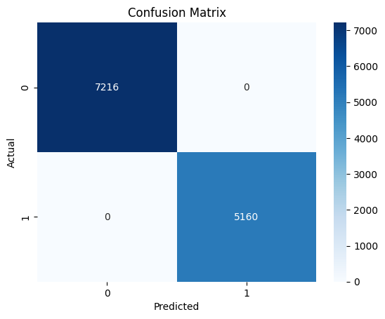

# Capstone: Log Classification using Supvervised Machine Learning

|          Accuracy: 1.0 |           |        |          |         |
|-----------------------:|:---------:|:------:|:--------:|--------:|
| Classification Report: | precision | recall | f1-score | support |
|                      0 |   1.00    |  1.00  |   1.00   |    7216 |
|                      1 |   1.00    |  1.00  |   1.00   |    5160 |
|                        |           |        |          |         |
|               accuracy |           |        |   1.00   |   12372 |
|              macro avg |   1.00    |  1.00  |   1.00   |   12372 |
|           weighted avg |   1.00    |  1.00  |   1.00   |   12372 |

---
### Notebook
To view the notebook, open the following link in separate tab/window.

The jupyter notebook [Capstone on Log Classification (nbviewer.org)](https://nbviewer.org/github/fc510/sctp-caps-log-classifier/blob/main/sctp_ml_log_data_RandomForestClassifier.ipynb)

***
### Data
Raw logs are obtained from `https://log-sharing.dreamhosters.com` as a tarball. Within which, the linux system `messages` log and apache httpd web `access_log` logs were selected for this project as they some of the most common logs available. 

The original tarball `hnet-hon-var-log-02282006.tgz` is is over 100MB and is not provide in this repository. Only the select system and web logs are retained and packaged as-is here as `raw_logs.tgz`.

As a sample, the `dataset.csv` is provided where all the log data are consolidated just before EDA happens.

| Artifacts                                     | Description                        |
|:----------------------------------------------|:-----------------------------------|
| raw_logs.tgz                                  | pre-selected system and web logs   |
| dataset.csv                                   | sample combined dataset            |
| sctp_caps_log_classifier.pptx                 | Capstone Project Presentation deck |
| sctp_ml_log_data_RandomForestClassifier.ipynb | jupyter notebook                   |

***
### Observations

- The dataset is imbalanced; the `messages` and `access_log` logs in a 2:3 proportion
- In general log length average about 150 words, as compared to some extreme of over 8000 words
- Due to the nature of log data, it isn't exactly a natural language and using NLP cleaning technique may not be ideal since some info within log data are inherent cryptic or "unnatural"
- Nonetheless, the RandomForestClassifier proves sufficiently capable to identify the log type
- The model perform well during training & testing achieving 100% accuracy, whereas during sampled inference test accuracy only managed over 70%

### Insights

- For each log type, having more log data and from more diverse sources certainly improve the model's performance
- However, 1 inherent constrain of this machine learning workflow design; there is a need create custom logic when new log type is introduced
- RandomForestClassifier (aka decision tree model) is intrinsically interpretable, and hence the explainability thru visualization is straightforward
- the machine learning model training is an iterative process, the workflow evolves with each repitition and improvement made

### Lesson Learnt

- a more robust strategy is required to manage the data source to enable an efficient pipeline
- understanding the dataset's characteristics, helps to formulate a initial set of hyperparameters for model training and to avoid issues like environment crashing

### Going forward...

- for comparison, XGBoost is a good candidate
- have more diverse sources of log data and expoentially increase the quantity
- explore deep learning techniqes to scale data ingestion capabilities

***
Connect with me [LinkedIn](https://www.linkedin.com/in/franklinchui/) 

